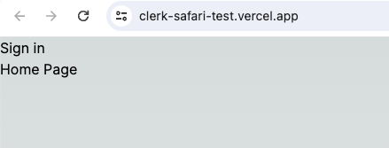
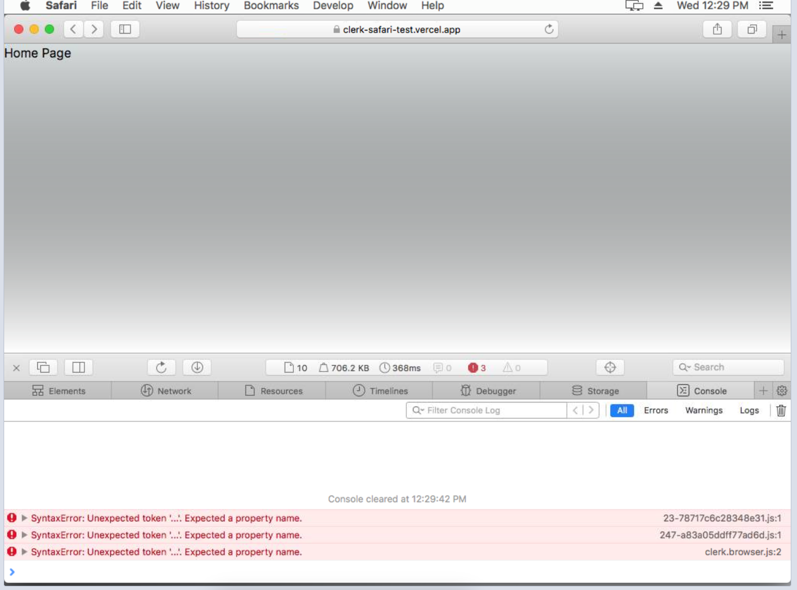

# Clerk Safari Test

This is a minimal next app with clerk to show that clerk is not working on Safari browsers < 13.

On the [working site](https://clerk-safari-test.vercel.app) you can see the **Sign In** button.

On Safari browsers < 13, the button is never shown because of errors in the clerk.js script.

